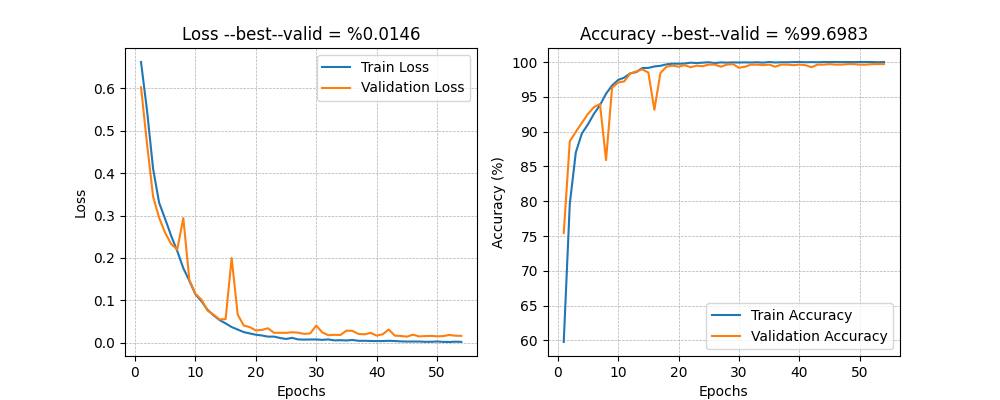
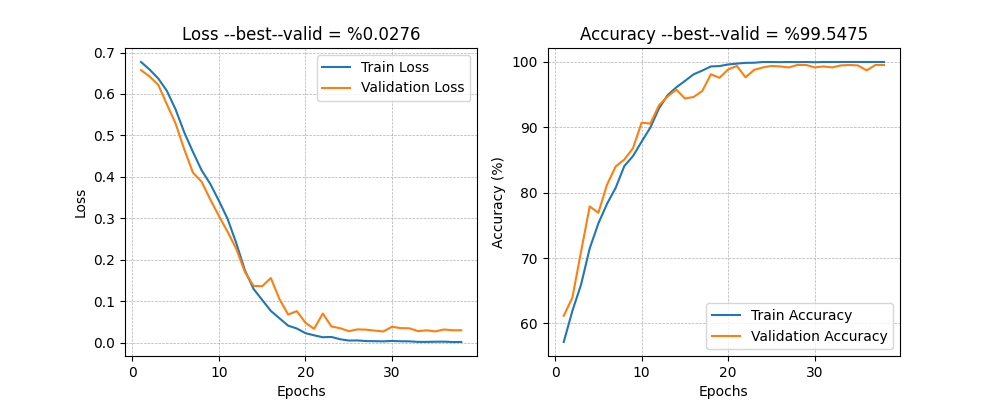
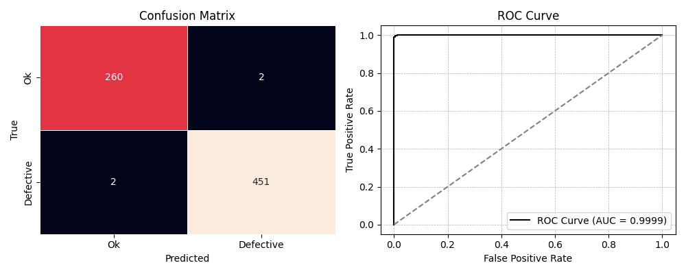
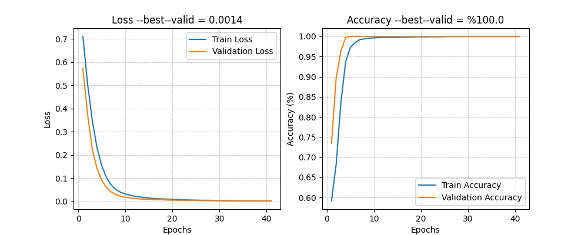
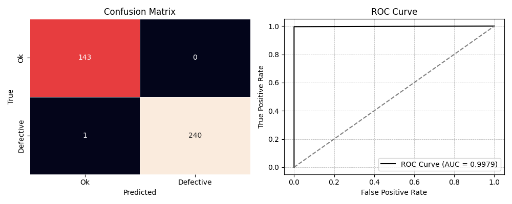
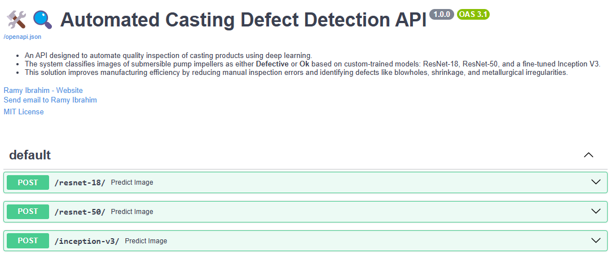

# Automated Casting Defect Detection

This initiative seeks to transform the casting manufacturing industry by automating the defect detection process. Traditionally, this task relies on manual inspection, which is not only time-consuming and labor-intensive but also susceptible to human error. To overcome these limitations, I have developed and implemented a deep learning-based solution using state-of-the-art architectures: ResNet-18, ResNet-50, and a fine-tuned Inception V3 model.

**Impact and Benefits**  

- Minimizing manual inspection errors.  
- Accelerating the defect detection process.  
- Enabling early identification of flaws to reduce production waste and costs.  

---

## ResNet-18

---

## ResNet-50

---

## Inception-V3

---

## Deployment  

To ensure a seamless and efficient deployment process, I utilized modern development tools and frameworks:  

**REST--APIs**  
   The trained models (ResNet-18, ResNet-50, and fine-tuned Inception V3) were deployed using **FastAPI**, enabling a robust and high-performance API for defect detection.  

**Containerization**  
The application was fully containerized using Docker and Docker Compose, ensuring:  

- Portability across environments.  
- Simplified deployment and scaling.  
- Streamlined dependency management.

---
